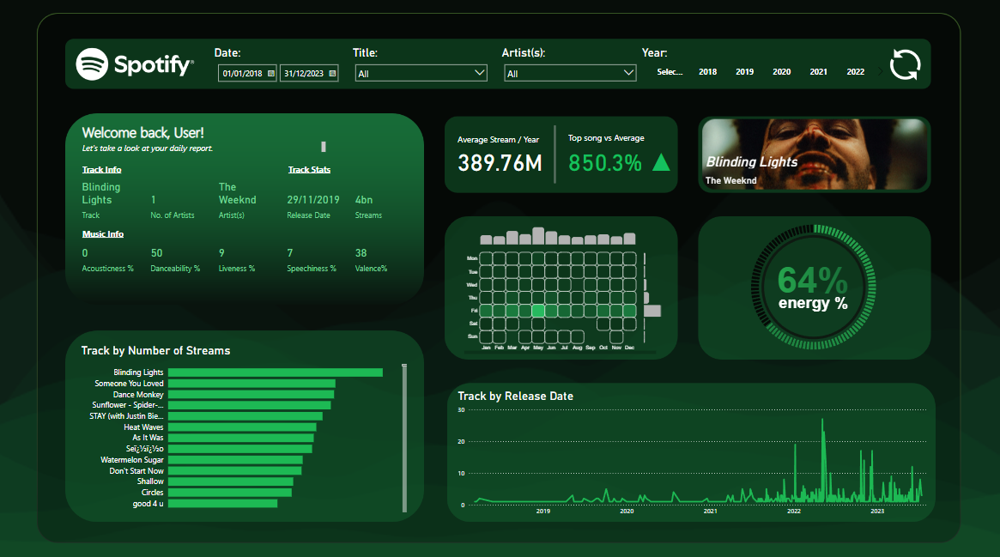

# Spotify Data Analysis & Visualization Project 🎧

### Check out the project here:

This project focuses on analyzing and visualizing the top songs of 2023 using data from a Kaggle Dataset and Spotify's API, alongside powerful tools like Deneb, Kaggle, Power BI, and Excel!

## 🛠️ Tools & Technologies
- **Spotify API**: To fetch album covers on the top tracks, artists, and playlists of 2023.
- **Kaggle**: Provided the main datasets for data comparisons.
- **Power BI**: For creating the main dashboard with interactive slicers, filters and visuals.
- **Deneb & HTML**: For powerful, customizable visualizations.
- **Excel**: Data cleaning, preprocessing, and statistical analysis.
- **Sharepoint**: To preview the final dashboard.

## 📊 Project Highlights
- **Data Collection**: Utilized data on the top songs of 2023 using the Kaggle API and added album covers through Spotify's API.
- **Data Processing**: Cleaned and organized the dataset using Excel and Power BI for optimal analysis.
- **Visualizations**: Engaging dashboards built with HTML, Deneb and Power BI, showcasing top tracks, artists, and streaming trends of 2023.
- **Analysis**: Explored music trends and user behavior by analyzing top songs, genres, and artists of 2023.

## 📈 Key Features
- Visualizations of the top songs of 2023.
- Insights into streaming trends, genre popularity, and top artists.
- Interactive dashboards with various filtering options.
- Comparative analysis of music attributes through acousticness, danceability, liveness and more!

## 💻 How to Run
1. Clone the repository.
2. Get your Spotify API credentials from [Spotify for Developers](https://developer.spotify.com/documentation/web-api/).
3. Alter the file paths in app.py.
4. Run the Dashboard_NEW.pbix file!
